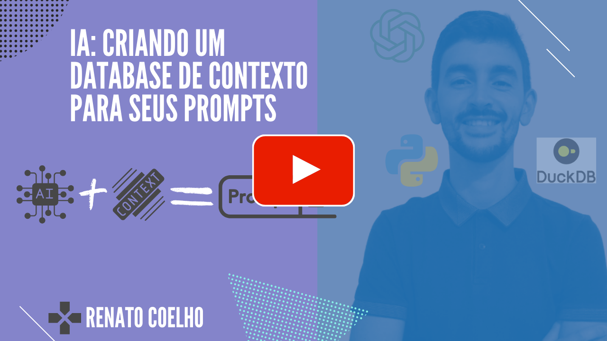

# IA: Criando um Database de Contexto para seus Prompts

Vou mostrar como desenvolver um sistema para otimizar o uso de **prompts** em aplicações de inteligência artificial, utilizando um banco de dados de contexto. Este projeto utiliza tecnologias como **Python**, DuckDB, Langchain entre outras. Destaca-se pelo uso do **DuckDB** como banco de dados vetorial, o que ajuda a gerenciar grandes volumes de dados de forma eficiente, enquanto a biblioteca **Langchain** é integrada para explorar as capacidades do modelo de linguagem **ChatGPT-3.5** ou superior.

Por meio desta integração, o projeto incorpora técnicas avançadas, como [**embeddings**](https://platform.openai.com/docs/guides/embeddings) e [**Retrieval-Augmented Generation (RAG)**](https://help.openai.com/en/articles/8868588-retrieval-augmented-generation-rag-and-semantic-search-for-gpts), demonstrando uma aplicação prática e sofisticada dos conceitos teóricos abordados. Esta combinação de ferramentas e técnicas não apenas eleva a precisão e eficiência das aplicações de **IA**, mas também exemplifica a prática de [***Few-Shot Prompting***](https://www.promptingguide.ai/pt/techniques/fewshot), na qual um prompt é apresentado com alguns exemplos que contribuem para um melhor entendimento do que está sendo solicitado.


# Apresentação em vídeo

<p align="center">
  <a href="https://www.youtube.com/@renato-coelho" target="_blank"></a>
</p>


### Requisitos

+ 

+ 

+ 

+ 


### Deploy da aplicação

##### Clonando o repositório:

```bash
git clone https://github.com/Renatoelho/ContextDB.git contextDB
```

##### Preparando o ambiente:

+ Acessando o diretório clonado
```bash
cd contextDB/app/
```

+ Criando o ambiente virtual
```bash
python3 -m venv .venv
```

+ Ativando o ambiente virtual
```bash
source .venv/bin/activate
```

+ Instalando as dependências
```bash
pip install pip setuptools wheel && pip install -r requirements.txt
```
***IMPORTANTE:*** atualize o arquivo [.env](app/.env) com o token de acesso da OpenAI, além de ser necessário ter créditos em sua conta na plataforma de desenvolvedor da OpenAI [https://platform.openai.com/](https://platform.openai.com).

+ Testando a aplicação
```bash
python3 ./app.py
```

***Observação***: para testar a aplicação com outras mensagens é só mudar o texto da vaiável ```atendimento``` no arquivo ```app.py```.


# Referências

**CARRARO, Fabricio.** INTELIGÊNCIA ARTIFICIAL E CHATGPT : Da revolução dos modelos de IA generativa à Engenharia de Prompt. 1. ed. São Paulo: Editora Casa do Código, 2023.

Python DB API, **DuckDB.** Disponível em: <https://duckdb.org/docs/api/python/dbapi>. Acesso em: 22 abr. 2024.

O que é RAG?, **AWS.** Disponível em: <https://aws.amazon.com/pt/what-is/retrieval-augmented-generation/>. Acesso em: 22 abr. 2024.

Word Embedding: fazendo o computador entender o significado das palavras - Uma introdução a conceitos muito importantes em NLP: embeddings e word2vec, **Medium.** Disponível em: <https://medium.com/turing-talks/word-embedding-fazendo-o-computador-entender-o-significado-das-palavras-92fe22745057>. Acesso em: 22 abr. 2024.

langchain_community.vectorstores.duckdb.DuckDB, **API Python Langchain.** Disponível em: <https://api.python.langchain.com/en/latest/vectorstores/langchain_community.vectorstores.duckdb.DuckDB.html>. Acesso em: 22 abr. 2024.

langchain_community.embeddings.openai.OpenAIEmbeddings, **OpenAIEmbeddings.** Disponível em: <https://api.python.langchain.com/en/latest/embeddings/langchain_community.embeddings.openai.OpenAIEmbeddings.html#langchain-community-embeddings-openai-openaiembeddings>. Acesso em: 22 abr. 2024.
